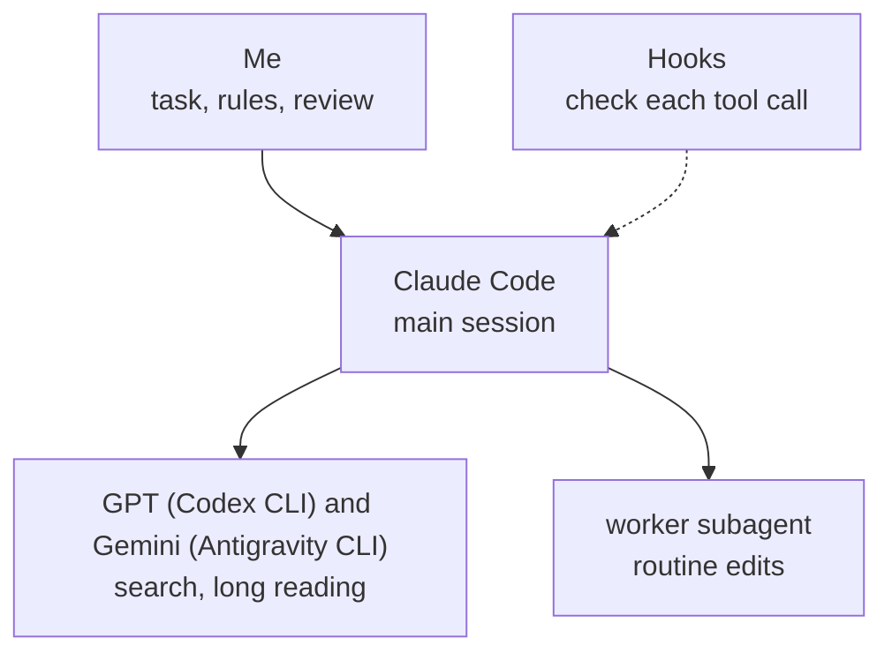

# AI coding setup for Claude Code, Codex and Gemini

This is the setup I run AI coding agents in for all my development: the rules I give them, automatic checks on each step, and three extensions for the Nimbalyst editor, where I work with Claude Code. Codex (GPT) and Gemini do the searching and long reading. Professionals in finance, data engineering and government IT installed the setup and use it at work.

I share the full setup privately as an install guide. This repository holds the part anyone can install with `node install.mjs`, and the source of the three extensions.



## What it looks like


Nimbalyst shows every conversation as a card on a board. Claude moves its own card from Planning to Complete as the work goes.


The usage panel from [extensions/usage-plan](extensions/usage-plan/README.md): both limits, and when the weekly one runs out at the current pace.

## Automatic checks on each step

Each check is a Node.js hook: a script that Claude Code runs around a step, and that can send the step back. Claude Code keeps a log of every tool call in a session, and the first two checks compare what the agent says with what that log shows it did.

- **`link-gate`**. Without it, a reply could hand me a link the agent remembered or saw in search results but never opened. With it, the reply is rejected until each link is opened or taken out.
- **`question-other`**. Without it, a recommended option could say "Checked: the docs" when nothing was looked up. With it, a "Checked:" reason is rejected unless it matches a file read or a search in the log; otherwise the option has to say "Judgment:".

Two more checks look at the command itself:

- **`command-explain`**. Without it, a permission prompt shows me a raw shell command. With it, a command is blocked unless it ends with a line in plain words saying what it does.
- **`opencli-readonly`**. Without it, the agent could post, like or follow from my logged-in accounts through OpenCLI. With it, only commands that OpenCLI itself marks `[read]` get through.

The other hooks keep sessions cheap and safe: `big-read-gate` (large files are read in parts), `sql-guard` (asks before DROP, TRUNCATE, or DELETE and UPDATE without WHERE), `context-guard` (warns when a session gets long) and `handoff-brief` (keeps a brief so a fresh session can continue). If a hook hits an error, it lets the call through rather than block work. `link-gate` counts an address as opened when a browser tool, WebFetch or a shell command went to it and didn't fail, so it can't tell whether the page said what the reply claims.

## Three models

Searching and long reading go to GPT and Gemini through their command-line tools, which run on my other subscriptions. Design and code stay with Claude. `worker-nudge` holds the agent to that: the first try at a search subagent is blocked and pointed at `codex` or `agy`. I added it after `scripts/usage-scan.mjs`, which reads the session logs, showed single search subagents using 0.6 to 4.3 million tokens.

For a hard question I ask all three with [skills/court](skills/court/SKILL.md). Claude, GPT and Gemini each answer on their own, GPT and Gemini review the answers without knowing who wrote which, and a Claude chair writes the verdict. I read it and decide. If `codex` or `agy` isn't installed, the panel goes on without that seat. [docs/setup.md](docs/setup.md) covers the rest: the rules I give the models and the `worker` agent for routine edits. `skills/lead` is the skill I use to split a big task across parallel sessions in Nimbalyst.

## Editor extensions

Three extensions for Nimbalyst, written in TypeScript and React. Each has its own README.

- [extensions/usage-plan](extensions/usage-plan/README.md) puts a ring on the editor's side bar with the week's usage, and opens a panel with the weekly and 5-hour limits, when the week runs out, and the daily budget against the daily pace. The forecast itself comes from a script in my usage tooling that isn't in this repository; the extension draws it.
- [extensions/read-aloud](extensions/read-aloud/README.md) reads replies aloud with Kokoro, a voice model that runs on the computer. It cleans a reply for speech (no code, no Markdown), and a Python worker speaks it sentence by sentence.
- [extensions/commands](extensions/commands/README.md) puts the commands I use most behind one button on the side bar: board cleanup, next move, project scan, setup audit, usage report and new project. A press starts a new session in the open project with that command. The commands are skills from my private setup; the extension only starts them.

## Install

Needs Node.js 18 or newer. I run it on Windows.

```
node install.mjs --dry-run
node install.mjs
```

The dry run prints every file it would copy and every hook it would add, and changes nothing. The real run copies `hooks`, `agents` and `skills` into `~/.claude` and adds the hook wiring from `settings.example.json` to `~/.claude/settings.json`. Before it replaces a file, it keeps the old one as `<name>.before-install-<date>`, so your own settings aren't lost. A second run changes nothing. The Codex CLI and the Antigravity CLI are optional. `question-other` and `command-explain` are written for Nimbalyst. The extensions build and install on their own (see their READMEs).

## Tests and the privacy check

```
node tests/run-all.mjs
```

The tests run each hook as a separate process on made-up session logs. They also run the court script without calling any model, the installer twice on a blank temporary home folder, and the extensions' unit tests. Last comes `scripts/privacy-check.mjs` on this repository. It looks for home folder paths, email addresses, API keys, AI credit lines, backup and `.env` files, and the words in a private list (`.privacy-words`, which git ignores). The tests run on GitHub Actions on every push. GitHub doesn't have my word list, so I also run the check myself before each release.

If you read one file, read `hooks/link-gate.mjs`.

## License

All rights reserved. You may download and run it to try it out, but not copy, modify or distribute it. See [LICENSE](LICENSE).
