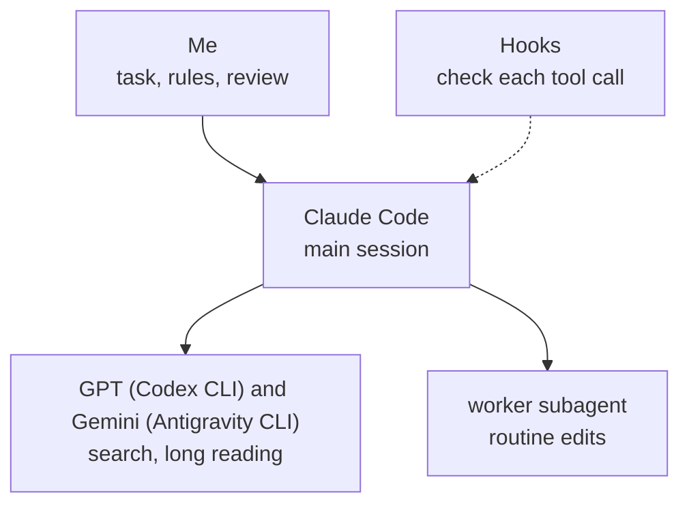

# AI coding setup for Claude Code, Codex and Gemini

This is the setup I run AI coding agents in for all my development: the rules I give them, automatic checks on each step, skills for the jobs I repeat, and three extensions for the Nimbalyst editor, where I work with Claude Code. Codex (GPT) and Gemini do the searching and long reading. Professionals in finance, data engineering and government IT installed the setup and use it at work.

This repository is the whole setup. One installer puts all of it in place; [docs/HOW-TO.md](docs/HOW-TO.md) says what to type afterwards and what you should see.

https://github.com/user-attachments/assets/ff97158a-9a66-4846-9334-8aec7e648c8b

The full tour, 1 min 43 s ([the file](docs/img/promo.mp4)). The short clips below are the same scenes, one section at a time. Everything in them is redrawn, with made-up projects and numbers.

## What is in it

| Part | What it does | Where |
|---|---|---|
| Rules | How the agent replies, asks, delegates and finishes work | [rules](rules) |
| Hooks | Scripts that check each step and can send it back | [hooks](hooks) |
| Skills | Commands for repeated jobs: `/court`, `/lead`, `/handoff`, `/btw`, `/setup-audit` and others | [skills](skills) |
| Starter projects | Four folders, each with its own rules and tools | [projects](projects) |
| Editor extensions | Usage pop-up, Read Aloud and a commands button for Nimbalyst | [extensions](extensions) |
| Worker agent | A cheaper subagent for routine edits | [agents](agents) |
| Installer | Puts all of the above in place, and keeps a copy of what it replaces | [install.mjs](install.mjs) |

## Checks on each step


Each check is a Node.js hook: a script that Claude Code runs around a step, and that can send the step back. Claude Code keeps a log of every tool call in a session, and the first two checks compare what the agent says with what that log shows it did.

- **`link-gate`**. Without it, a reply could hand me a link the agent remembered or saw in search results but never opened. With it, the reply is rejected until each link is opened or taken out.
- **`question-other`**. Without it, a recommended option could say "Checked: the docs" when nothing was looked up. With it, a "Checked:" reason is rejected unless it matches a file read or a search in the log; otherwise the option has to say "Judgment:".
- **`command-explain`**. Without it, a permission prompt shows me a raw shell command. With it, a command is blocked unless it ends with a line in plain words saying what it does.
- **`run-yourself`**. Without it, a reply could end with "now open a terminal and run this". With it, the agent is sent back once to run the command itself.
- **`opencli-readonly`**. Without it, the agent could post, like or follow from my logged-in accounts through OpenCLI. With it, only commands that OpenCLI itself marks `[read]` get through.

The other hooks keep sessions cheap and safe:

| Hook | What it does |
|---|---|
| `big-read-gate` | Large files are read in parts, not whole |
| `worker-nudge` | Sends searching to Codex or Gemini (see the next section) |
| `loop-warn` | Tells the agent when it repeats the same call |
| `sql-guard` | Asks before DROP, TRUNCATE, or DELETE and UPDATE without WHERE |
| `context-guard` | Warns when a session gets long, and has the agent offer a handoff |
| `handoff-brief` | Rewrites a brief after every reply, so a fresh session can continue |
| `board-nudge` | Offers a board cleanup when many sessions have piled up |
| `usage-dashboard-hook` | Typing just `usage` opens the usage dashboard |
| `plan-usage-logger` | Saves the plan percentages every 5 minutes for the forecast |

`plan-usage-logger` reads your saved Claude login, `~/.claude/.credentials.json`, and asks api.anthropic.com for the plan percentages. On a Mac the login is in the Keychain, so the forecast stays empty ([how to switch it off](docs/HOW-TO.md)). If a hook hits an error, it lets the call through rather than block work. `link-gate` counts an address as opened when a browser tool, WebFetch or a shell command went to it and didn't fail, so it can't tell whether the page said what the reply claims.

## Three models


Searching and long reading go to GPT and Gemini through their command-line tools, which run on my other subscriptions. Design and code stay with Claude. `worker-nudge` holds the agent to that: the first try at a search subagent is blocked and pointed at `codex` or `agy`. I added it after `scripts/usage-scan.mjs`, which reads the session logs, showed single search subagents using 0.6 to 4.3 million tokens.



- **The court.** For a hard question I ask all three with [skills/court](skills/court/SKILL.md). Claude, GPT and Gemini each answer on their own, GPT and Gemini review the answers without knowing who wrote which, and a Claude chair writes the verdict. I read it and decide. If `codex` or `agy` isn't installed, the panel goes on without that seat.
- **The lead.** For a big task, [skills/lead](skills/lead/SKILL.md) splits the work across child sessions in Nimbalyst that run side by side, has a separate session review the result, sends the fixes back and reports what it checked.

[docs/setup.md](docs/setup.md) covers the rest: the rules I give the models and the `worker` agent for routine edits.

## Long and busy sessions


- **A note to a busy session.** Nimbalyst holds a new message until the running reply ends. [skills/steer](skills/steer/steer.mjs) gets around that: `/btw <note>` in a second chat leaves a note that the busy session reads before its next step, and `/ask <question>` answers a question about that session without touching its work.
- **Automatic handoff.** Every step re-sends the whole conversation, so a long session gets expensive. `handoff-brief` rewrites a short brief after every reply without being asked, and at 200k tokens `context-guard` has the agent offer to move the work to a fresh session that starts from that brief. `/handoff` does the same on request. The brief is also there when the Claude plan runs out, so the work can go on in a GPT or Gemini session.
- **The board.** Nimbalyst shows every conversation as a card on a board, and Claude moves its own card from Planning to Complete as the work goes. `/board-cleanup` moves the finished ones that were left behind.

<details>
<summary>The real board</summary>


</details>

## Usage: the forecast and the dashboard


The percentage alone is what every usage meter shows. This one answers the next questions.

- **When does it run out?** [extensions/usage-plan](extensions/usage-plan/README.md) puts a ring on the editor's side bar with the week's usage. Its pop-up shows the weekly and 5-hour limits, the day and hour the week runs out at the current pace, and the daily budget that would make it last against the daily pace.
- **Where did it go?** Typing `usage` opens a dashboard built by [skills/usage-report](skills/usage-report/SKILL.md): tokens by project, by model, per day and per chat, the main chat apart from its subagents, the Codex and Gemini runs each chat started, and what the same work would cost at API prices. It is one HTML file that works offline, built from the logs on the computer, so opening it uses no tokens.
- **Who used it?** The dashboard splits this computer's use from other use of the same account.

<details>
<summary>The real pop-up</summary>


</details>

## Four starter projects, and the rules


The installer creates four project folders, each with its own rules and tools ([projects](projects)). A request that has nothing to do with the open project isn't worked on there: the agent names the project it belongs to and opens it.

| Project | For | Its own tools |
|---|---|---|
| `claude-settings` | Changing and checking the setup itself | `/setup-audit`, `/usage-report`, `/chat-review` |
| `ask-anything` | General questions | The court, the picture skill, reading web pages and videos |
| `internet-search` | Finding things online | A finder skill with a fixed order, and its own link gate that accepts only pages that were opened |
| `quick-tasks` | One-off file jobs | A dated folder per job, work on copies, the picture skill |

With Codex installed, `ask-anything` and `quick-tasks` get the picture skill. It has Codex draw an illustration of how something looks or works, for example a flat front view of a workbench with its clamps in the right places, from a reference photo and a few sourced facts. It doesn't edit your own images. A hook shows the result only after it passes a written checklist.

The rules are plain files. [rules/CLAUDE.md](rules/CLAUDE.md) is read in every session: lead with the answer, do the work yourself, ask one question with options when the choice matters, fix a repeated mistake in the rule that caused it. `/new-project` gives a folder its own `CLAUDE.md`, a `HANDOFF.md` (where the work stands) and a `DECISIONS.md`, and a decision I confirm is written there at once.

## Editor extensions


Three extensions for Nimbalyst, written in TypeScript and React. Each has its own README.

- [extensions/usage-plan](extensions/usage-plan/README.md) is the ring and the pop-up from the usage section.
- [extensions/read-aloud](extensions/read-aloud/README.md) reads replies aloud with Kokoro, a voice model that runs on the computer. It cleans a reply for speech (no code, no Markdown), and a Python worker speaks it sentence by sentence.
- [extensions/commands](extensions/commands/README.md) puts the commands I use most behind one button on the side bar: board cleanup, next move, project scan, setup audit, usage report and new project. A press starts a new session in the open project with that command. The six commands are skills in [skills](skills).

## Install

Needs Node.js 18 or newer. I run it on Windows.

```
node install.mjs --dry-run
node install.mjs
```

The dry run prints every file it would copy and every hook it would add, and changes nothing. The real run does four things:

- copies `hooks`, `agents` and `skills` into `~/.claude`;
- adds the hook wiring from `settings.example.json` to `~/.claude/settings.json`;
- writes the rules file `~/.claude/CLAUDE.md` if there is none;
- creates the four projects under `~/Projects` (`--projects <folder>` for another place).

Before it replaces a file, it keeps the old one as `<name>.before-install-<date>`, so your own settings aren't lost. A second run changes nothing. The Codex CLI and the Antigravity CLI are optional: the installer looks for them and writes the rules to fit. `question-other` and `command-explain` are written for Nimbalyst. The extensions build and install on their own (see their READMEs).

## Tests and the privacy check

```
node tests/run-all.mjs
```

The tests run each hook as a separate process on made-up session logs. They also run the court script without calling any model, the installer twice on a blank temporary home folder, and the extensions' unit tests. Last comes `scripts/privacy-check.mjs` on this repository. It looks for home folder paths, email addresses, API keys, AI credit lines, backup and `.env` files, and the words in a private list (`.privacy-words`, which git ignores). The tests run on GitHub Actions on every push. GitHub doesn't have my word list, so I also run the check myself before each release.

If you read one file, read `hooks/link-gate.mjs`. The video is drawn with Remotion; its source is in [promo](promo).

## License

All rights reserved. You may download it, use it and change your own installed copy, but not publish, distribute or sell it, and not present a changed version as mine. See [LICENSE](LICENSE).
