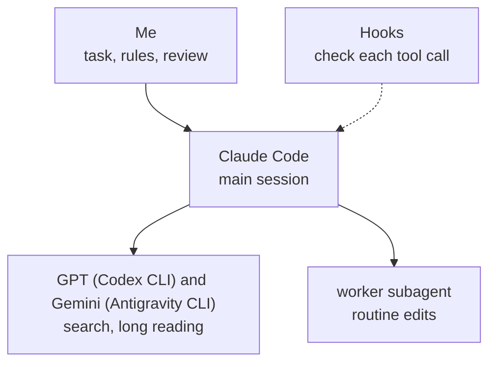

# AI coding setup for Claude Code, Codex and Gemini

This is the setup I run AI coding agents in for all my development: the rules I give them, automatic checks on each step, and three extensions for the Nimbalyst editor, where I work with Claude Code. Codex (GPT) and Gemini do the searching and long reading. Professionals in finance, data engineering and government IT installed the setup and use it at work.

This repository is the whole setup. One installer puts the rules, the hooks, the skills and four starter projects in place; [docs/HOW-TO.md](docs/HOW-TO.md) says what to type afterwards and what you should see.

[](docs/img/promo.mp4)



## What it looks like


Nimbalyst shows every conversation as a card on a board. Claude moves its own card from Planning to Complete as the work goes.


The usage panel from [extensions/usage-plan](extensions/usage-plan/README.md): both limits, and when the weekly one runs out at the current pace.

## Automatic checks on each step

Each check is a Node.js hook: a script that Claude Code runs around a step, and that can send the step back. Claude Code keeps a log of every tool call in a session, and the first two checks compare what the agent says with what that log shows it did.

- **`link-gate`**. Without it, a reply could hand me a link the agent remembered or saw in search results but never opened. With it, the reply is rejected until each link is opened or taken out.
- **`question-other`**. Without it, a recommended option could say "Checked: the docs" when nothing was looked up. With it, a "Checked:" reason is rejected unless it matches a file read or a search in the log; otherwise the option has to say "Judgment:".

Three more look at the command, or at how the reply ends:

- **`command-explain`**. Without it, a permission prompt shows me a raw shell command. With it, a command is blocked unless it ends with a line in plain words saying what it does.
- **`opencli-readonly`**. Without it, the agent could post, like or follow from my logged-in accounts through OpenCLI. With it, only commands that OpenCLI itself marks `[read]` get through.

- **`run-yourself`**. Without it, a reply could end with "now open a terminal and run this". With it, the agent is sent back once to run the command itself.

The other hooks keep sessions cheap and safe: `big-read-gate` (large files are read in parts), `loop-warn` (tells the agent when it repeats the same call), `sql-guard` (asks before DROP, TRUNCATE, or DELETE and UPDATE without WHERE), `context-guard` (warns when a session gets long), `handoff-brief` (keeps a brief so a fresh session can continue), `board-nudge` (offers a board cleanup when many sessions have piled up), `usage-dashboard-hook` (typing just `usage` opens the usage dashboard) and `plan-usage-logger` (every 5 minutes it reads your saved Claude login, `~/.claude/.credentials.json`, and asks api.anthropic.com for the plan percentages; on a Mac the login is in the Keychain, so the forecast stays empty; [how to switch it off](docs/HOW-TO.md)). If a hook hits an error, it lets the call through rather than block work. `link-gate` counts an address as opened when a browser tool, WebFetch or a shell command went to it and didn't fail, so it can't tell whether the page said what the reply claims.

## Three models

Searching and long reading go to GPT and Gemini through their command-line tools, which run on my other subscriptions. Design and code stay with Claude. `worker-nudge` holds the agent to that: the first try at a search subagent is blocked and pointed at `codex` or `agy`. I added it after `scripts/usage-scan.mjs`, which reads the session logs, showed single search subagents using 0.6 to 4.3 million tokens.

For a hard question I ask all three with [skills/court](skills/court/SKILL.md). Claude, GPT and Gemini each answer on their own, GPT and Gemini review the answers without knowing who wrote which, and a Claude chair writes the verdict. I read it and decide. If `codex` or `agy` isn't installed, the panel goes on without that seat. [docs/setup.md](docs/setup.md) covers the rest: the rules I give the models and the `worker` agent for routine edits. `skills/lead` is the skill I use to split a big task across parallel sessions in Nimbalyst.

## While a session is busy

Nimbalyst holds a new message until the running reply ends. [skills/steer](skills/steer/steer.mjs) gets around that: `/btw <note>` in a second chat leaves a note that the busy session reads before its next step, and `/ask <question>` answers a question about that session without touching its work. `/handoff` moves a long session to a fresh one with a short brief.

## Four starter projects

The installer creates four project folders, each with its own rules and tools ([projects](projects)):

- `claude-settings`: where the setup itself is changed and checked (`/setup-audit`, `/usage-report`).
- `ask-anything`: general questions, and the court.
- `internet-search`: finding things online. Its own link gate accepts only pages that were opened.
- `quick-tasks`: one-off file jobs.

With Codex installed, `ask-anything` and `quick-tasks` also get the picture skill. It has Codex draw an illustration of how something looks or works, for example a flat front view of a workbench with its clamps in the right places, from a reference photo and a few sourced facts. It doesn't edit your own images. A hook shows the result only after it passes a written checklist.

## Editor extensions

Three extensions for Nimbalyst, written in TypeScript and React. Each has its own README.

- [extensions/usage-plan](extensions/usage-plan/README.md) puts a ring on the editor's side bar with the week's usage, and opens a small pop-up with the weekly and 5-hour limits, when the week runs out, and the daily budget against the daily pace. The numbers come from [skills/usage-report](skills/usage-report/SKILL.md), which also builds a dashboard of Claude, Codex and Gemini use.
- [extensions/read-aloud](extensions/read-aloud/README.md) reads replies aloud with Kokoro, a voice model that runs on the computer. It cleans a reply for speech (no code, no Markdown), and a Python worker speaks it sentence by sentence.
- [extensions/commands](extensions/commands/README.md) puts the commands I use most behind one button on the side bar: board cleanup, next move, project scan, setup audit, usage report and new project. A press starts a new session in the open project with that command. The six commands are skills in [skills](skills).

## Install

Needs Node.js 18 or newer. I run it on Windows.

```
node install.mjs --dry-run
node install.mjs
```

The dry run prints every file it would copy and every hook it would add, and changes nothing. The real run copies `hooks`, `agents` and `skills` into `~/.claude`, adds the hook wiring from `settings.example.json` to `~/.claude/settings.json`, writes the rules file `~/.claude/CLAUDE.md` if there is none, and creates the four projects under `~/Projects` (`--projects <folder>` for another place). Before it replaces a file, it keeps the old one as `<name>.before-install-<date>`, so your own settings aren't lost. A second run changes nothing. The Codex CLI and the Antigravity CLI are optional: the installer looks for them and writes the rules to fit. `question-other` and `command-explain` are written for Nimbalyst. The extensions build and install on their own (see their READMEs).

## Tests and the privacy check

```
node tests/run-all.mjs
```

The tests run each hook as a separate process on made-up session logs. They also run the court script without calling any model, the installer twice on a blank temporary home folder, and the extensions' unit tests. Last comes `scripts/privacy-check.mjs` on this repository. It looks for home folder paths, email addresses, API keys, AI credit lines, backup and `.env` files, and the words in a private list (`.privacy-words`, which git ignores). The tests run on GitHub Actions on every push. GitHub doesn't have my word list, so I also run the check myself before each release.

If you read one file, read `hooks/link-gate.mjs`.

## License

All rights reserved. You may download it, use it and change your own installed copy, but not publish, distribute or sell it, and not present a changed version as mine. See [LICENSE](LICENSE).
