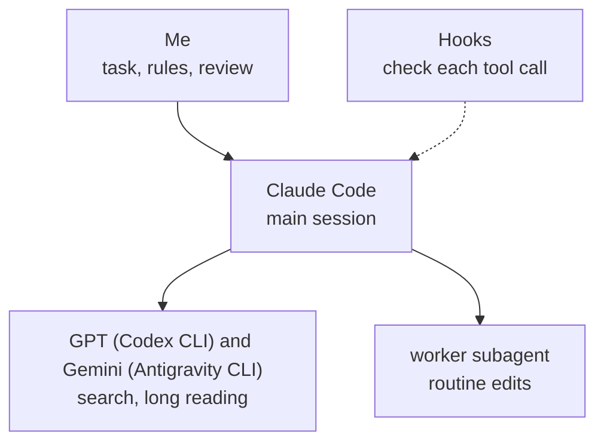
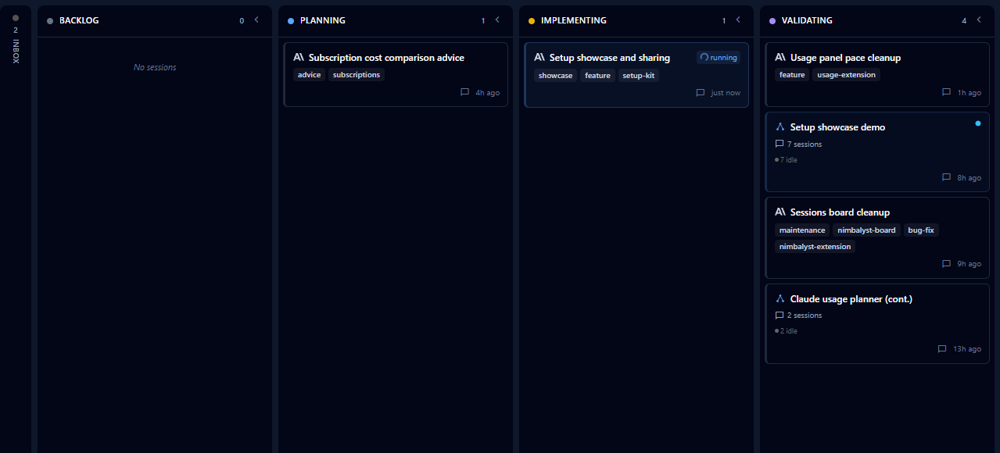
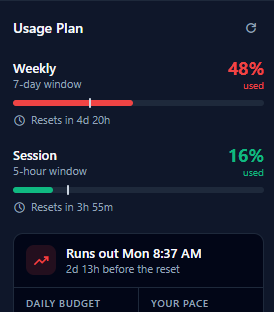

# AI coding setup for Claude Code, Codex and Gemini

The rules, checks and skills I run AI coding agents with for all my development. The checks compare what an agent says with the log of what it did: a reply that links a page it never opened is rejected, and so is "checked" with no lookup behind it. Claude Code writes the code; Codex (GPT) and Gemini do the searching and long reading.

Professionals in finance, data engineering and government IT installed it and use it at work.

https://github.com/user-attachments/assets/2bf61db5-d115-49d1-ad46-0006cd18db26

## What's new

**October 4, 2026, version 1.0.2: you stay on the model you picked.** The rules no longer expect new chats to start on Sonnet, and Claude no longer stops to ask whether to move to Opus. The rules file every chat loads is shorter.

**October 4, 2026, version 1.0.0: the setup updates itself.** Once a day it checks whether a newer version is released and says so in one line. Typing `/update-setup` installs it without asking anything again, and keeps your own skills, hooks, settings and notes.

**October 4, 2026: one command for the free workers.** Searching and long reading now go through [workers/ask.mjs](workers/ask.mjs). It picks the first worker that is ready, moves to the next one when a worker runs out of usage, and says which one answered. The setup now works the same with a ChatGPT subscription, a Google one, both or neither, and a search no longer stops because one worker is busy.

Earlier changes are in [CHANGELOG.md](CHANGELOG.md).

## Install

Needs Claude Code, installed and signed in. Download the ZIP or clone the repository, then in its folder:

```
claude "Read docs/full-install.md and carry out every step in it."
```

Claude Code asks which subscriptions you have (ChatGPT for Codex, Google AI for Gemini; both optional), then installs what is missing: Nimbalyst, Node.js, Git, uv, Handy, the Codex and Antigravity CLIs, the files below, the plugins and a few settings. The steps are in [docs/full-install.md](docs/full-install.md).

Only the files, with Node.js 18 or newer:

```
node install.mjs --dry-run
node install.mjs
```

This copies `hooks`, `agents` and `skills` into `~/.claude`, wires the hooks into `~/.claude/settings.json`, writes `~/.claude/CLAUDE.md` if there is none, and creates four project folders under `~/Projects`. A file it replaces is kept as `<name>.before-install-<date>`.

- **Without Nimbalyst:** the rules, hooks and skills work in plain Claude Code. The extensions, the session board and `/lead` need Nimbalyst, the editor I run Claude Code in. `question-other` and `command-explain` are written for it too.
- **Mac:** I run the setup on Windows. The tests also run on macOS, but the full install has not been run on a real Mac, and Read Aloud is Windows only.
- **Afterwards:** [docs/HOW-TO.md](docs/HOW-TO.md) says what to type and what you should see.

## Updating

Once a day the setup asks GitHub whether a newer version is released ([hooks/update-check.mjs](hooks/update-check.mjs)) and says so in one line. Nothing is downloaded until you type `/update-setup`. That runs [update.mjs](skills/update-setup/update.mjs): it downloads the release to `~/.claude/setup-source` and runs its installer with the answers you gave the first time.


- **Yours stays yours.** The installer only writes the setup's own files. Skills, hooks, settings and notes you added are not touched, and every replaced file is kept as `<name>.before-install-<date>`.
- **Rules.** A `~/.claude/CLAUDE.md` you never changed is brought up to date. One you changed is replaced only after you say yes.
- **Without a chat:** `node ~/.claude/skills/update-setup/update.mjs`, or `--check` to only look.
- **Installed before version 1.0.0?** Download the repository once more and run the install again; from then on it updates itself.
- **Off switch:** set `UPDATE_CHECK=off` to stop the daily check.

## What's inside

| Part | What it does | Where |
|---|---|---|
| Rules | How the agent replies, asks, delegates and finishes work | [rules](rules) |
| Hooks | Scripts that check each step and can send it back | [hooks](hooks) |
| Skills | Commands for repeated jobs: `/court`, `/lead`, `/handoff`, `/btw`, `/setup-audit` and others | [skills](skills) |
| Starter projects | Four folders, each with its own rules and tools | [projects](projects) |
| Editor extensions | Usage pop-up, Read Aloud and a commands button for Nimbalyst | [extensions](extensions) |
| Worker agent | A cheaper subagent for routine edits | [agents](agents) |
| Worker command | One short command for searching and long reading. It uses the first free worker that is set up and working (Codex, then Gemini through Antigravity), says which one answered, and hands the job back to Claude when none can | [workers](workers) |
| Installer | Puts the files in place and keeps a copy of what it replaces | [install.mjs](install.mjs) |
| Updater | Says when a newer version is out; `/update-setup` installs it and keeps your own files | [skills/update-setup](skills/update-setup) |
| Tour video | The Remotion source of the video above | [promo](promo) |

## Checks


Each check is a Node.js hook: a script Claude Code runs around a step, and that can send the step back. Claude Code logs every tool call in a session, and the first two hooks compare a reply with that log. If you read one file, read [hooks/link-gate.mjs](hooks/link-gate.mjs).

| Hook | What it sends back |
|---|---|
| `link-gate` | A reply with a link the agent remembered or saw in search results but never opened |
| `question-other` | A recommended option that says "Checked:" when no file read or search in the log matches it |
| `command-explain` | A shell command that doesn't end with a line in plain words saying what it does |
| `run-yourself` | A reply that ends with "now open a terminal and run this"; the agent runs it itself |
| `opencli-readonly` | Posting, liking or following from my logged-in accounts through OpenCLI |

The other hooks keep sessions cheap and safe:

| Hook | What it does |
|---|---|
| `big-read-gate` | Large files are read in parts, not whole |
| `worker-nudge` | Sends searching to the first free worker that is ready (Codex, Gemini) |
| `loop-warn` | Tells the agent when it repeats the same call |
| `sql-guard` | Asks before DROP, TRUNCATE, or DELETE and UPDATE without WHERE |
| `context-guard` | Warns when a session gets long, and has the agent offer a handoff |
| `handoff-brief` | Rewrites a brief after every reply, so a fresh session can continue |
| `board-nudge` | Offers a board cleanup when many sessions have piled up |
| `update-check` | Says once a day when a newer version of the setup is released |
| `usage-dashboard-hook` | Typing just `usage` opens the usage dashboard |
| `plan-usage-logger` | Saves the plan percentages every 5 minutes for the forecast |

A hook that hits an error lets the call through. `link-gate` knows that a page was opened, not what it said.

## Three models


Searching and long reading go to GPT and Gemini through their command-line tools, which run on my other subscriptions. Design and code stay with Claude. `worker-nudge` holds the agent to that: the first try at a search subagent is blocked and pointed at one command, [workers/ask.mjs](workers/ask.mjs). That command tries the workers in order (Codex, then Antigravity for local files; Codex for the web), skips one that is not installed, switched off or out of usage, prints which one answered and why another was skipped, and tells the agent to do the job itself when none can. So the setup works with either subscription, both or neither. I added it after `scripts/usage-scan.mjs`, which reads the session logs, showed single search subagents using 0.6 to 4.3 million tokens.



- **The court.** For a hard question I ask all three with [skills/court](skills/court/SKILL.md). Claude, GPT and Gemini each answer on their own, GPT and Gemini review the answers without knowing who wrote which, and a Claude chair writes the verdict. I read it and decide.
- **The lead.** For a big task, [skills/lead](skills/lead/SKILL.md) splits the work across child sessions in Nimbalyst that run side by side, has a separate session review the result, sends the fixes back and reports what it checked.

The rules I give the models are described in [docs/setup.md](docs/setup.md).

## Sessions


- **A note to a busy session.** Nimbalyst holds a new message until the running reply ends. With [skills/steer](skills/steer/steer.mjs), `/btw <note>` in a second chat leaves a note that the busy session reads before its next step, and `/ask <question>` answers a question about that session without touching its work.
- **Handoff.** Every step re-sends the whole conversation, so a long session gets expensive. `handoff-brief` rewrites a short brief after every reply, and at 200k tokens `context-guard` has the agent offer to move the work to a fresh session that starts from that brief. `/handoff` does the same on request. The brief also lets the work go on in a GPT or Gemini session when the Claude plan runs out.
- **The board.** Nimbalyst shows every conversation as a card on a board, and Claude moves its own card from Planning to Complete as the work goes. `/board-cleanup` moves the finished ones that were left behind.

<details>
<summary>Screenshot of the board</summary>



</details>

## Usage


- **The forecast.** [extensions/usage-plan](extensions/usage-plan/README.md) puts a ring on the editor's side bar with the week's usage. Its pop-up shows the weekly and 5-hour limits, the day and hour the week runs out at the current pace, and the daily budget that would make it last.
- **The dashboard.** Typing `usage` opens one HTML file built by [skills/usage-report](skills/usage-report/SKILL.md) from the logs on the computer, so opening it uses no tokens. It shows tokens by project, model, day and chat, the main chat apart from its subagents, the Codex and Gemini runs each chat started, what the same work would cost at API prices, and this computer's use apart from other use of the same account.

For the forecast, `plan-usage-logger` reads your saved Claude login, `~/.claude/.credentials.json`, and asks api.anthropic.com for the plan percentages.

<details>
<summary>Screenshot of the pop-up</summary>



</details>

## Starter projects


The installer creates four project folders ([projects](projects)). A request that has nothing to do with the open project isn't worked on there: the agent names the project it belongs to and opens it.

| Project | For | Its own tools |
|---|---|---|
| `claude-settings` | Changing and checking the setup itself | `/setup-audit`, `/usage-report`, `/chat-review` |
| `ask-anything` | General questions | The court, the picture skill, reading web pages and videos |
| `internet-search` | Finding things online | A finder skill with a fixed order, and its own link gate that accepts only pages that were opened |
| `quick-tasks` | One-off file jobs | A dated folder per job, work on copies, the picture skill |

With Codex installed, `ask-anything` and `quick-tasks` get the picture skill. It has Codex draw an illustration of how something looks or works from a reference photo and a few sourced facts, for example a flat front view of a workbench with its clamps in the right places. A hook shows the result only after it passes a written checklist.

## Rules

[rules/CLAUDE.md](rules/CLAUDE.md) is read in every session: lead with the answer, do the work yourself, ask one question with options when the choice matters, fix a repeated mistake in the rule that caused it. `/new-project` gives a folder its own `CLAUDE.md`, a `HANDOFF.md` (where the work stands) and a `DECISIONS.md`, and a decision I confirm is written there at once.

## Editor extensions


Three extensions for Nimbalyst, written in TypeScript and React.

- [usage-plan](extensions/usage-plan/README.md) is the ring and the pop-up from the usage section.
- [read-aloud](extensions/read-aloud/README.md) reads replies aloud with Kokoro, a voice model that runs on the computer. It cleans a reply for speech (no code, no Markdown), and a Python worker speaks it sentence by sentence.
- [commands](extensions/commands/README.md) puts six commands behind one button on the side bar: board cleanup, next move, project scan, setup audit, usage report and new project. A press starts a new session in the open project with that command.

## Voice typing


I speak most of my prompts. [Handy](https://handy.computer) types what I say where the cursor is: hold a key, talk, release. The speech model runs on the computer.

```
winget install --id cjpais.Handy -e
```

On a Mac: `brew install --cask handy`. The settings I use (on Windows the full install sets them):

| Setting | Value |
|---|---|
| Model | Parakeet V3 (`parakeet-tdt-0.6b-v3`, the 8-bit file), kept loaded |
| Shortcut | Hold Right Alt to talk |
| Output | Typed directly, with a space after it; the clipboard is left alone |
| Clean-up | Filler words removed, silence cut |
| Custom words | Names the model gets wrong: Nimbalyst, Claude, Codex, Gemini, handoff |
| Start | With Windows, hidden in the tray |

## Tests

```
node tests/run-all.mjs
```

Each hook runs as a separate process on made-up session logs. The court script runs without calling a model, the installer runs twice on an empty home folder, and `scripts/privacy-check.mjs` scans the repository for home folder paths, email addresses and API keys. GitHub Actions runs all of it on every push, on Windows and on macOS.

## License

All rights reserved. You may download it, use it and change your own installed copy, but not publish, distribute or sell it, and not present a changed version as mine. See [LICENSE](LICENSE).
