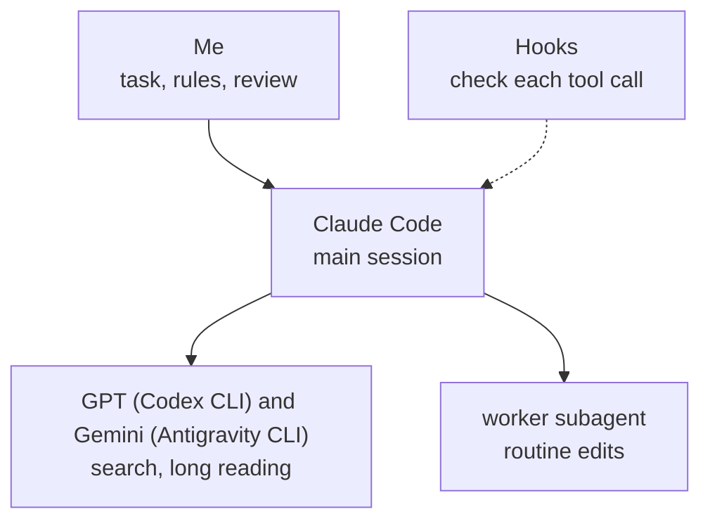

# How I work with coding agents

The hooks in this repository are one part of how I work with coding agents. I set the task and the rules, the tools do the work I hand them, and I review the result and approve anything risky. This page describes the rest of that setup.

## What I do myself

- **I set the task.** I say what I want, what must not change and how the result will be checked. If a requirement is unclear and the choice matters, the rules have the model ask me one question with options instead of guessing.
- **I make the decisions.** Each project has a `DECISIONS.md`. What I decide goes in there with the date, and later sessions read it first and don't reopen it.
- **I approve what's risky.** A shell command I haven't already allowed comes to me as a permission prompt. It has to end with a line in plain words saying what it does, so I know what I'm approving. `sql-guard` asks me before a DROP, a TRUNCATE, or a DELETE or UPDATE without WHERE.
- **I review the result.** The model has to show the check it ran and the output before it calls anything done, and I read both before I accept the work.

## What I hand to each tool

The rule: searching and long reading go to GPT (through the Codex CLI) and Gemini (through the Antigravity CLI), which run on my other subscriptions. Design and code stay with Claude. One command, [workers/ask.mjs](../workers/ask.mjs), picks the worker: the first one that is set up and working. It moves to the next when one is out of usage, says which one answered, and hands the job back to Claude when none can.

| Tool | What I use it for | Limits I set |
|---|---|---|
| Claude Code in the Nimbalyst editor (the main session) | Planning a change with me, writing and editing the code, running the checks | It does what I asked and nothing else: no unrelated refactoring, no extra features |
| GPT (Codex CLI) and Gemini (Antigravity CLI) | Searching a project, reading long files and logs, web research, a second opinion on a plan or a diff | They never edit files, and their answers are leads that get checked |
| `worker` subagent ([agents/worker.md](../agents/worker.md)) | Routine edits that follow a clear plan | A smaller model, and it stops after 25 turns |

Searching and long reading cost the most on the main model, which is why they go to the other two. For a hard question, where one model's answer isn't enough, I ask all three with the [court skill](../skills/court/SKILL.md): GPT, Gemini and Claude answer on their own, GPT and Gemini review the answers without knowing who wrote them, and a Claude chair sums up. I read the verdict and decide. For a larger task I use a [skill](../skills/lead/SKILL.md) that splits the work across child sessions (research, build, an independent review, fixes), so what comes back to me has already been checked once.

## The rules I wrote

A global instruction file holds the rules for every session. The file is [rules/CLAUDE.md](../rules/CLAUDE.md), and the installer puts it at `~/.claude/CLAUDE.md`. The main ones:

- Ask when a requirement is unclear and the choice matters. For a small, reversible choice, pick a default and say so.
- Do what was asked: no unrelated refactoring, no features nobody asked for.
- Nothing is called done without a real check and its output.
- Searching and long reading go to a cheaper tool. Planning and the final check of the work stay in the main session.
- Every subagent gets the inputs it needs and a budget of tool calls, and reports back when the budget runs out.
- Large files are read in parts, and big command output is processed outside the conversation.

## Rules that became hooks

Written rules were sometimes skipped: a large file was read whole, or a search subagent was started anyway. I saw it in the numbers. `scripts/usage-scan.mjs` reads the session transcripts and reports tokens per session and per subagent, and it showed search subagent runs using 0.6 to 4.3 million tokens each. So I turned each rule that mattered into a hook, a script that runs around a tool call and can block it.

| When | Hook | Rule it enforces |
|---|---|---|
| Before a file read or shell command | `big-read-gate` | Read large files in parts |
| Before a subagent starts | `worker-nudge` | Searching goes to the first free worker that is ready (Codex or Gemini) |
| Before a shell command | `command-explain` | Explain the command in plain words |
| Before a shell command | `sql-guard` | Confirm destructive SQL with me |
| Before a shell command | `opencli-readonly` | In my signed-in browser, only read: never post, like, follow or log in |
| Before a question to me | `question-other` | Every choice lets me type my own answer, and a recommendation that says "Checked:" must match a lookup in the session log |
| Before any tool call | `loop-warn` | Tell the agent when it repeats the same call |
| When I send a message | `context-guard` | Warn when the session passes 200k tokens |
| When I send a message | `board-nudge` | Offer a board cleanup when many sessions have piled up |
| When I send a message | `update-check` | Say once a day when a newer version of the setup is released |
| When I send a message | `usage-dashboard-hook` | Typing just `usage` opens the usage dashboard without a model call |
| While a session runs | `plan-usage-logger` | Save the plan's 5-hour and weekly percentages every 5 minutes, for the usage forecast |
| Before a reply goes out | `link-gate` | No link that wasn't opened in this session |
| Before a reply goes out | `run-yourself` | A reply that tells me to run a command is sent back once, so the agent runs it |
| After each reply | `handoff-brief` | Keep a brief so a new session can continue |

In the seven days up to October 1, 2026, `big-read-gate` stopped 11 whole-file reads and `worker-nudge` stopped 3 search subagents. I use the scanner's counts to decide which rule needs a hook next. The wiring is in [settings.example.json](../settings.example.json).

## Long sessions

A long session sends its whole history again on every step, so every step costs more. When `context-guard` warns, I move the work to a fresh session: the [handoff skill](../skills/handoff/SKILL.md) writes a short brief (goal, state, next step, files) and the new session starts from it. `handoff-brief` also rewrites that brief after every reply, so one exists even when a session ends unexpectedly.

Each project keeps three short files that a new session reads first: `CLAUDE.md` (rules and commands for the project), `HANDOFF.md` (current state and what's next) and `DECISIONS.md` (what I decided and when).
