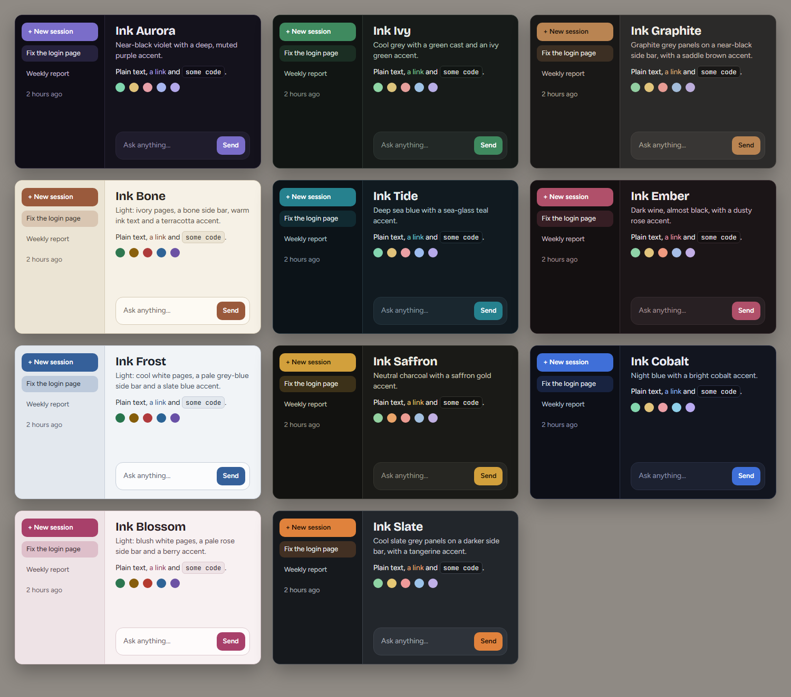

# Ink themes

Eleven colour themes for Nimbalyst. They share one look (the Figtree and Bricolage Grotesque fonts,
rounder shapes, a name under every side button, a floating message box) and differ only in colour.



| Theme | What it looks like |
|---|---|
| **Ink Aurora** | Near-black violet with a deep, muted purple accent |
| **Ink Ivy** | Cool grey with a green cast and an ivy green accent |
| **Ink Graphite** | Graphite grey panels on a near-black side bar, with a saddle brown accent |
| **Ink Bone** | Light: ivory pages, a bone side bar, warm ink text and a terracotta accent |
| **Ink Tide** | Deep sea blue with a sea-glass teal accent |
| **Ink Ember** | Dark wine, almost black, with a dusty rose accent |
| **Ink Frost** | Light: cool white pages, a pale grey-blue side bar and a slate blue accent |
| **Ink Noir** | Black and white only: black panels, grey text and a white button |
| **Ink Cobalt** | Night blue with a bright cobalt accent |
| **Ink Blossom** | Light: blush white pages, a pale rose side bar and a berry accent |
| **Ink Neon** | Plum black with a hot magenta accent and electric cyan links |

## Install

It needs Node and nothing else: there is nothing to download.

```
npm run build
npm run install-ext
```

The second command prints `installed to` and the folder. Restart Nimbalyst, press the **Theme**
button at the bottom of the side bar, press **Ink themes** to unfold the list and pick one. The
themes sit under that one row so the menu stays short; the row also names the one that is on.
Nothing else changes until you pick a theme, and picking any other theme puts everything back as
it was.

## What it adds besides colour

- A **New session** button and a Sessions / Files / Tracker switch at the top of the side panel.
- Two usage bars at the bottom of the sessions panel (this week, the 5-hour window). They read the
  numbers the side bar's own rings show, so they appear only when those rings do.
- Bigger usage rings with a percent that can be read on a large monitor.

Every added part presses or reads one of the app's own buttons. If an update of the app renames
one, that part does not appear and the app's own button stays.

## Changing or adding a theme

Each theme is about twenty base colours in [themes.mjs](themes.mjs); the build turns them into the
full set the app asks for. After a change:

```
npm test
```

It rebuilds and checks that every text colour can be read on its background (page, side bar and
raised boxes), that the text on the accent can be read, and that the styles apply only while one of
these themes is on.

To try a theme on a running window without installing it, start Nimbalyst with
`--remote-debugging-port=9222`, run `node build.mjs --preview <file.js> <theme id>` and run that
file in the window's inspector. `node build.mjs --swatches <file.html>` writes the page the picture
above was taken from.

## Files

| File | What |
|---|---|
| `themes.mjs` | The colours of each theme |
| `theme.src.css` | Fonts, shapes and labels, shared by all the themes |
| `shell.js` | The New session button, the switch, the usage bars and the folded theme menu |
| `build.mjs` | Writes `manifest.json` and `dist/` |
| `test.mjs` | The checks |
| `fonts/` | Figtree, Bricolage Grotesque and JetBrains Mono, each under the SIL Open Font License |
