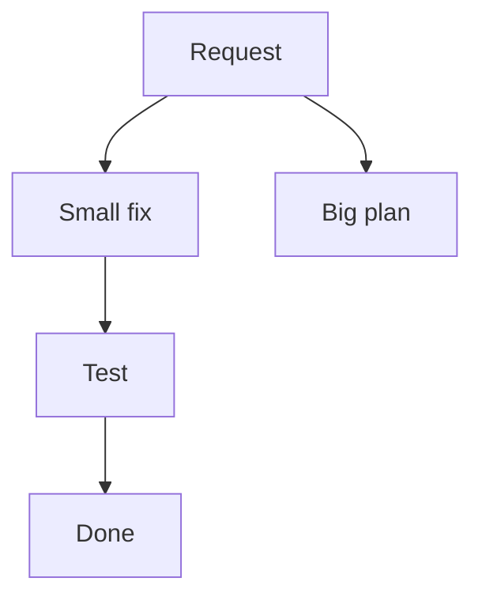

# A clean page

A short page that every page check passes: one small diagram that branches, a link to a file that is
there ([the other page](cut-label.md)) and an image that loads.

```mermaid
flowchart TD
  ask[Request] --> fix[Small fix]
  ask --> plan[Big plan]
  fix --> test[Test]
  test --> done[Done]
```
